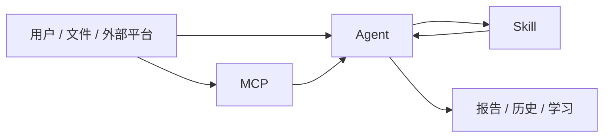
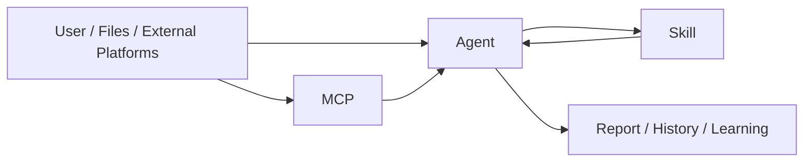

# MegaETH Agent / MCP Library
<!-- security-log-analysis mainline -->

## 中文版

这份文档是专门用来防止三个词混掉的：
- `Skill`
- `Agent`
- `MCP`

如果你后面继续训练系统，这三个词一定要分清。不然很容易出现一种情况：明明是接入层的问题，结果去改 Skill；或者其实是 Agent 分流问题，却一直怀疑 MCP 数据不对。

### 最短理解

- `MCP`
  - 负责把外部世界的数据带进来
- `Agent`
  - 负责判断怎么处理这些数据
- `Skill`
  - 负责做具体分析

一句话就是：

```text
MCP 把材料带进来
Agent 决定怎么处理
Skill 产出分析结果
```

### 关系图



### Agent

#### `megaeth.agent.core`

这是平台真正的主分析体，不是一个装饰性命名。

它负责：
- 接输入
- 补 memory
- 调 `normalizer`
- 调 `planner`
- 执行 Skills
- 做风险判断
- 生成报告
- 写历史

如果一份材料“分析方向完全跑偏”，我一般优先怀疑这里的链路，而不是先怀疑 UI。

现在这层已经开始接第一条模型试点：
- JumpServer 多源审计
- 绑定方式是 `Agent` 级别，不是 `Skill` 自己直接带模型

我这样设计是为了把三层边界守住：
- `MCP` 只负责把 JumpServer 文件带进来
- `Agent` 负责决定要不要调用模型、调用哪个模型
- `Skill` 继续约束固定模板和判断边界

当前打开方式也很直接：

```bash
export GEMINI_API_KEY=你的服务端key
export GEMINI_MODEL_JUMPSERVER=gemini-2.5-flash
```

这里我特意保留了兜底：
- 没配 key，系统照样能跑，只是继续走本地规则版 JumpServer 结论
- 配了 key，Agent 才会替 JumpServer 那条链生成综合结论和综合判断

#### `megaeth.agent.learning`

这一层负责让系统别总从零开始。

它做的事包括：
- 保存分类经验
- 保存偏好的 Skills
- 记录最近学习反馈
- 合并重复规则

这里的坑我前面已经踩过：如果只改了 learning 逻辑，但没确认在线服务已经切到新版本，用户看到的还是旧行为。所以现在每次相关改动后，都要连运行态一起核。

### MCP

#### `megaeth.mcp.bitdefender`

这是当前第一个正式跑起来的 MCP。

它现在更适合做：
- 验证连接
- 看最近有没有新的可分析内容
- 把安全报表导入平台分析

我现在不会再把它当成“完全等价控制台”的设备总览页，因为 Bitdefender 公共 API 和控制台视图口径并不完全一致。这个坑已经踩过，不再假设设备总数一定能对上。

#### `megaeth.mcp.whitebox_appsec`

这条是白盒 AppSec 接入层。

现在已经有：
- 接入骨架
- 三段式训练顺序
  - recon
  - validation
  - report synthesis

这里的原则是固定的：
- 用 MegaETH 自己的命名
- 不把引用方产品名字、提示词、风格带进最终对外表达

### 什么时候该改哪一层

我一般这么分：

- 连接不上外部平台
  - 先看 `MCP`
- 分类不对、Skill 选错
  - 先看 `Agent`
- finding 太浅、报告不够准
  - 先看对应 `Skill`

这个判断很重要，因为它直接决定你改哪里效率最高。

---

## English Version

This document exists to stop three terms from getting mixed together:
- `Skill`
- `Agent`
- `MCP`

If we keep training the system, these boundaries matter. Otherwise it becomes very easy to fix the wrong layer.

### The shortest explanation

- `MCP`
  - brings data in from the outside world
- `Agent`
  - decides how that data should be handled
- `Skill`
  - performs the actual analysis

In one line:

```text
MCP brings material in
Agent decides what to do
Skill produces the analytical output
```

### Relationship diagram



### Agent

#### `megaeth.agent.core`

This is the main analytical brain of the platform.

It is responsible for:
- receiving input
- enriching with memory
- calling the normalizer
- calling the planner
- executing Skills
- scoring risk
- building reports
- writing history

If a report is directionally wrong, I usually inspect this flow before blaming the UI.

This layer now has its first model-backed pilot:
- JumpServer multi-source audit
- the model binding belongs to the `Agent`, not directly to the `Skill`

That keeps the boundary clean:
- `MCP` brings JumpServer evidence in
- `Agent` decides whether to call a model and which model to use
- `Skill` still constrains the final report structure and safety boundary

The minimal server-side setup is:

```bash
export GEMINI_API_KEY=your_server_key
export GEMINI_MODEL_JUMPSERVER=gemini-2.5-flash
```

Fallback behavior is intentional:
- without the key, the system still runs and uses rule-based JumpServer reporting
- with the key, the Agent can improve the composite conclusion and final judgment while keeping the MegaETH template

#### `megaeth.agent.learning`

This layer exists so the system does not start from zero every time.

It handles:
- classification memory
- preferred Skill memory
- recent learning feedback
- duplicate rule merging

We already learned one painful lesson here: changing learning logic is not enough unless the live service is actually running that version.

### MCP

#### `megaeth.mcp.bitdefender`

This is the first MCP that is truly running in the platform.

It is best used for:
- connection verification
- checking whether there is fresh analyzable content
- importing security report content into the platform

I no longer treat it as a perfect replica of the Bitdefender control center. The public API view and the console view do not fully match, especially around device totals.

#### `megaeth.mcp.whitebox_appsec`

This is the whitebox AppSec intake layer.

It already has:
- an integration scaffold
- a three-stage training path
  - recon
  - validation
  - report synthesis

The rule here is fixed:
- keep MegaETH naming
- do not expose borrowed product names, prompt text, or external branding in final platform language

### Which layer to change first

My practical rule is:
- if the external platform connection is wrong, inspect `MCP`
- if classification or Skill routing is wrong, inspect `Agent`
- if findings or report quality are weak, inspect the relevant `Skill`
