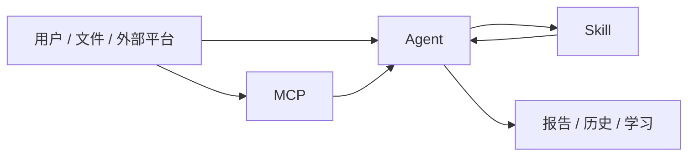
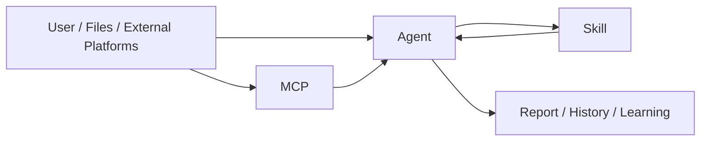

# System Design / 系统设计
<!-- security-log-analysis mainline -->

## 中文版

这份文档我更建议你在两种情况下看：
- 服务已经跑起来了，但你想知道一份材料到底是怎么走到报告里的
- 结果不对，你准备开始查是哪一层跑偏了

如果你还没跑起来，先回 [README.md](/Users/lei/Documents/New%20project/megaeth-ai-security-rebuild/README.md)。那边是上手路线，这边更像排障地图。

### 一句话理解这套架构

这套系统不是“一个大模型前端”，而是三层配合：
- `MCP` 负责把外部材料或外部平台数据带进来
- `Agent` 负责判断、分流、编排
- `Skill` 负责做具体分析

对应关系大概是：



### 一次分析是怎么跑的

最常见的一条链是：

```text
材料进来
-> memory 先补经验
-> normalizer 归一化
-> planner 选 Skill
-> skills 执行
-> risk engine 定级
-> report engine 出报告
-> history / memory 落盘
```

这里有两个坑我已经踩过很多次了：
- 看起来像 Skill 分析错了，其实是 `normalizer` 一开始就分错类了
- 代码本地改对了，但运行服务没切过去，或者前端还在吃旧资源

后面查问题时，我一般按这个顺序看：
1. `normalized_event`
2. `planner_preview`
3. `report`
4. 最新落库
5. 页面实际展示

### 目录怎么对应到运行链

真正的主线在这些位置：

- [app/main.py](/Users/lei/Documents/New%20project/megaeth-ai-security-rebuild/app/main.py)
  - FastAPI 入口和静态资源挂载
- [app/api/core_routes.py](/Users/lei/Documents/New%20project/megaeth-ai-security-rebuild/app/api/core_routes.py)
  - 核心分析入口、历史、学习相关接口
- [app/api/integration_routes.py](/Users/lei/Documents/New%20project/megaeth-ai-security-rebuild/app/api/integration_routes.py)
  - MCP 入口
- [app/core/normalizer.py](/Users/lei/Documents/New%20project/megaeth-ai-security-rebuild/app/core/normalizer.py)
  - 原始材料转成统一事件
- [app/core/planner.py](/Users/lei/Documents/New%20project/megaeth-ai-security-rebuild/app/core/planner.py)
  - 按材料类型和经验规则选 Skill
- [app/skills/implementations.py](/Users/lei/Documents/New%20project/megaeth-ai-security-rebuild/app/skills/implementations.py)
  - Skill 执行实现
- [app/core/risk_engine.py](/Users/lei/Documents/New%20project/megaeth-ai-security-rebuild/app/core/risk_engine.py)
  - 风险标签和分数
- [app/core/report_engine.py](/Users/lei/Documents/New%20project/megaeth-ai-security-rebuild/app/core/report_engine.py)
  - 中文报告生成
- [app/core/memory_service.py](/Users/lei/Documents/New%20project/megaeth-ai-security-rebuild/app/core/memory_service.py)
  - 学习规则和反馈
- [app/core/history.py](/Users/lei/Documents/New%20project/megaeth-ai-security-rebuild/app/core/history.py)
  - 最近结果、历史和调查会话

### Memory 在这里到底干嘛

Memory 最有价值的不是“存很多”，而是“让下一次少走弯路”。

它现在主要记这些：
- 文件名特征
- 表头特征
- 内容特征
- parser profile
- 期望的 `source_type`
- 期望的 `event_type`
- 偏好的 Skills

我现在会特别留意一件事：Memory 改了，不代表用户马上就能看到对的结果。还得一起确认：
- 服务已经重启
- 最新落库确实是新逻辑
- 前端不是旧缓存

这个坑前面已经踩过多次了，所以现在已经当成默认检查项。

### 现在已经接上的 MCP

当前有两条主线：

- Bitdefender
  - 适合做接入验证、最新可分析内容判断、导入报表到平台分析
- Whitebox AppSec
  - 现在是骨架 + 训练模板，适合后面按 case 继续训

重点不是“接了多少接口”，而是：
- 接进来的数据能不能被 Agent 消化
- 最终能不能产出有用的中文报告

### 现在先别指望它做什么

有些事这套系统还不是目标：
- 分布式执行器
- 企业级租户隔离
- 生产自动处置
- 完整 OCR 流水线
- 数据库级持久层

它现在最合适的定位还是：
- 单机可运行
- 可持续训练
- 可解释
- 可审计的安全分析工作台

### 我一般怎么验证一条链是通的

如果我要确认“这套没坏”，通常不会先点很多页面，而是直接跑：

```bash
cd '/Users/lei/Documents/New project/megaeth-ai-security-rebuild'
curl -s http://127.0.0.1:8010/health
curl -s http://127.0.0.1:8010/pipeline/overview
curl -s http://127.0.0.1:8010/skills
```

然后再用一份最小样本走一遍 `/ingest/files`。这样比纯看 UI 更快定位问题到底是在后端还是前端。

---

## English Version

This document is best used in two situations:
- the service is already running and you want to understand how material becomes a report
- something looks wrong and you need to know which layer to inspect first

If you have not started the project yet, use [README.md](/Users/lei/Documents/New%20project/megaeth-ai-security-rebuild/README.md) first. That file gets the system running. This one explains how the moving parts fit together.

### The shortest way to think about the architecture

The system is really three layers working together:
- `MCP` brings in external data or outside platform content
- `Agent` decides how to route and orchestrate the analysis
- `Skill` performs the actual analysis



### What one analysis run looks like

The most common path is:

```text
material arrives
-> memory adds prior hints
-> normalizer builds a typed event
-> planner selects Skills
-> skills execute
-> risk engine scores the result
-> report engine builds the report
-> history and memory persist the outcome
```

Two failure modes are common:
- what looks like a Skill problem is often already a classification problem in `normalizer`
- local code is fixed, but the running service or frontend assets are still old

When I troubleshoot, I usually inspect:
1. `normalized_event`
2. `planner_preview`
3. `report`
4. latest persisted output
5. actual UI rendering

### Which files matter most

The main flow lives here:
- [app/main.py](/Users/lei/Documents/New%20project/megaeth-ai-security-rebuild/app/main.py)
- [app/api/core_routes.py](/Users/lei/Documents/New%20project/megaeth-ai-security-rebuild/app/api/core_routes.py)
- [app/api/integration_routes.py](/Users/lei/Documents/New%20project/megaeth-ai-security-rebuild/app/api/integration_routes.py)
- [app/core/normalizer.py](/Users/lei/Documents/New%20project/megaeth-ai-security-rebuild/app/core/normalizer.py)
- [app/core/planner.py](/Users/lei/Documents/New%20project/megaeth-ai-security-rebuild/app/core/planner.py)
- [app/skills/implementations.py](/Users/lei/Documents/New%20project/megaeth-ai-security-rebuild/app/skills/implementations.py)
- [app/core/risk_engine.py](/Users/lei/Documents/New%20project/megaeth-ai-security-rebuild/app/core/risk_engine.py)
- [app/core/report_engine.py](/Users/lei/Documents/New%20project/megaeth-ai-security-rebuild/app/core/report_engine.py)
- [app/core/memory_service.py](/Users/lei/Documents/New%20project/megaeth-ai-security-rebuild/app/core/memory_service.py)
- [app/core/history.py](/Users/lei/Documents/New%20project/megaeth-ai-security-rebuild/app/core/history.py)

### What Memory is really for

Memory is not about storing everything. Its value is in making the next similar material take a better path.

It currently remembers:
- filename tokens
- header tokens
- content tokens
- parser profile
- expected `source_type`
- expected `event_type`
- preferred Skills

One lesson we had to learn the hard way: changing Memory logic is not enough. You also need to confirm:
- the service restarted
- the latest persisted output reflects the new logic
- the frontend is not serving stale assets

### Current MCP lines

The main MCP lines right now are:
- Bitdefender
- Whitebox AppSec

The point is not “how many APIs are connected.” The real question is:
- can the imported data be consumed by the Agent
- can it lead to a useful Chinese-first report

### What this system is not trying to be yet

Not the current goal:
- distributed execution
- enterprise tenant isolation
- production auto-remediation
- full OCR pipeline
- database-backed persistence

The current target is a single-machine, trainable, explainable security analysis workbench.

### My quick verification path

When I want to confirm the system is still healthy, I usually start here:

```bash
cd '/Users/lei/Documents/New project/megaeth-ai-security-rebuild'
curl -s http://127.0.0.1:8010/health
curl -s http://127.0.0.1:8010/pipeline/overview
curl -s http://127.0.0.1:8010/skills
```

Then I post one tiny sample to `/ingest/files`. That reveals backend issues faster than clicking around in the UI first.
